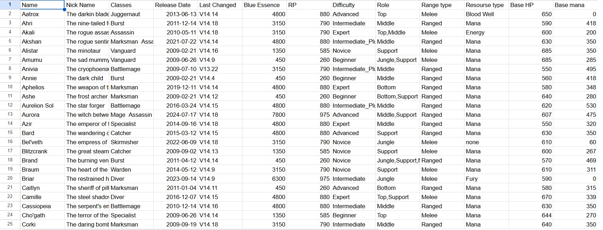
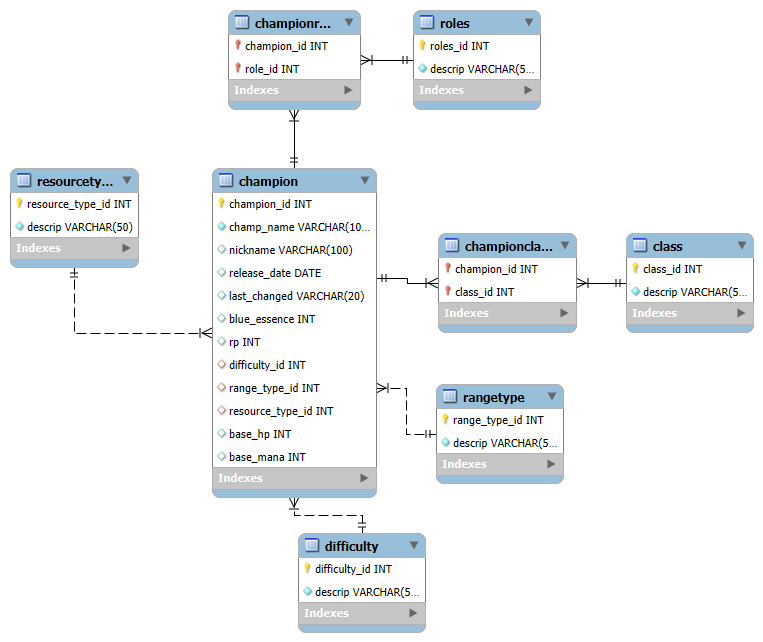

# Base de datos de League of Legends Champions

## Descripción
Este trabajo tiene como propósito principal desarrollar habilidades en el diseño y normalización de bases de datos relacionales, utilizando como caso de estudio la información de los campeones del videojuego League of Legends.

El proyecto aborda la transformación de datos estructurados desde un archivo CSV hacia un sistema de gestión de base de datos MySQL, implementando técnicas de normalización para optimizar el almacenamiento y consulta de información.

La base de datos fue obtenida a través de la descarga de un archivo csv de la página de Kaggle.
- https://www.kaggle.com/datasets/marwant1/league-of-legends-champions-2024?select=League+of+legend+Champions+2024.csv

La base de datos contiene un catálogo completo de 168 campeones de League of Legends con los siguientes atributos:
- Identificación y denominación de cada campeón
- Clasificación por categorías y posiciones de juego
- Historial de versiones y actualizaciones
- Sistema de precios en monedas del juego
- Niveles de complejidad de uso
- Características de combate (alcance y recursos)
- Valores numéricos de estadísticas fundamentales



## Configuración del Entorno
Para implementar esta base de datos en tu sistema local, sigue estos pasos:

```bash
git clone https://github.com/axelvilla/LoLChampions2024.git
```

Importa el esquema de base de datos en tu servidor MySQL:

```sql
mysql -u tu_usuario -p < lolchampions.sql
```

## Modelo de Datos
El siguiente diagrama representa la estructura relacional implementada para el almacenamiento de información de campeones:



## Metodología de Normalización

El proceso de diseño comenzó con el análisis del archivo fuente CSV, identificando patrones de datos y relaciones entre entidades para establecer un esquema óptimo.

La implementación del esquema se realizó mediante la siguiente declaración:

```sql
CREATE DATABASE lolchampionsdataset;
```

El desarrollo del esquema contempló la creación de entidades principales y tablas de referencia, utilizando tipos de datos específicos y estableciendo relaciones mediante claves foráneas para mantener la integridad referencial.

### Tabla Champion (Principal)
```sql
CREATE TABLE `champion` (
  `champion_id` int NOT NULL AUTO_INCREMENT,
  `champ_name` varchar(100) NOT NULL,
  `nickname` varchar(100) DEFAULT NULL,
  `release_date` date DEFAULT NULL,
  `last_changed` varchar(20) DEFAULT NULL,
  `blue_essence` int DEFAULT NULL,
  `rp` int DEFAULT NULL,
  `difficulty_id` int DEFAULT NULL,
  `range_type_id` int DEFAULT NULL,
  `resource_type_id` int DEFAULT NULL,
  `base_hp` int DEFAULT NULL,
  `base_mana` int DEFAULT NULL,
  PRIMARY KEY (`champion_id`),
  KEY `difficulty_id` (`difficulty_id`),
  KEY `range_type_id` (`range_type_id`),
  KEY `resource_type_id` (`resource_type_id`),
  CONSTRAINT `champion_ibfk_1` FOREIGN KEY (`difficulty_id`) REFERENCES `difficulty` (`difficulty_id`),
  CONSTRAINT `champion_ibfk_2` FOREIGN KEY (`range_type_id`) REFERENCES `rangetype` (`range_type_id`),
  CONSTRAINT `champion_ibfk_3` FOREIGN KEY (`resource_type_id`) REFERENCES `resourcetype` (`resource_type_id`)
);
```

### Tablas de Referencia

**Tabla Difficulty**
```sql
CREATE TABLE `difficulty` (
  `difficulty_id` int NOT NULL AUTO_INCREMENT,
  `descrip` varchar(50) NOT NULL,
  PRIMARY KEY (`difficulty_id`),
  UNIQUE KEY `name` (`descrip`)
);
```

**Tabla RangeType**
```sql
CREATE TABLE `rangetype` (
  `range_type_id` int NOT NULL AUTO_INCREMENT,
  `descrip` varchar(50) NOT NULL,
  PRIMARY KEY (`range_type_id`),
  UNIQUE KEY `name` (`descrip`)
);
```

**Tabla ResourceType**
```sql
CREATE TABLE `resourcetype` (
  `resource_type_id` int NOT NULL AUTO_INCREMENT,
  `descrip` varchar(50) NOT NULL,
  PRIMARY KEY (`resource_type_id`),
  UNIQUE KEY `name` (`descrip`)
);
```

**Tabla Roles**
```sql
CREATE TABLE `roles` (
  `roles_id` int NOT NULL AUTO_INCREMENT,
  `descrip` varchar(50) NOT NULL,
  PRIMARY KEY (`roles_id`),
  UNIQUE KEY `name` (`descrip`)
);
```

**Tabla Class**
```sql
CREATE TABLE `class` (
  `class_id` int NOT NULL AUTO_INCREMENT,
  `descrip` varchar(50) NOT NULL,
  PRIMARY KEY (`class_id`),
  UNIQUE KEY `name` (`descrip`)
);
```

### Tablas de Relación Many-to-Many

**Tabla ChampionRole (Relación Champion-Roles)**
```sql
CREATE TABLE `championrole` (
  `champion_id` int NOT NULL,
  `role_id` int NOT NULL,
  PRIMARY KEY (`champion_id`,`role_id`),
  KEY `role_id` (`role_id`),
  CONSTRAINT `championrole_ibfk_1` FOREIGN KEY (`champion_id`) REFERENCES `champion` (`champion_id`) ON DELETE CASCADE,
  CONSTRAINT `championrole_ibfk_2` FOREIGN KEY (`role_id`) REFERENCES `roles` (`roles_id`) ON DELETE CASCADE
);
```

**Tabla ChampionClass (Relación Champion-Classes)**
```sql
CREATE TABLE `championclass` (
  `champion_id` int NOT NULL,
  `class_id` int NOT NULL,
  PRIMARY KEY (`champion_id`,`class_id`),
  KEY `class_id` (`class_id`),
  CONSTRAINT `championclass_ibfk_1` FOREIGN KEY (`champion_id`) REFERENCES `champion` (`champion_id`) ON DELETE CASCADE,
  CONSTRAINT `championclass_ibfk_2` FOREIGN KEY (`class_id`) REFERENCES `class` (`class_id`) ON DELETE CASCADE
);
```
A partir de la creación de todas las tablas, se puede a comenzar a insertar los datos en cada una de las tablas.

```sql
  INSERT INTO rangetype(descrip)
  SELECT distinct `Range type` from finaldbtest.`league of legend champions 2024` where `Range type` is not null
```

## Ejemplos de Consultas

El siguiente conjunto de consultas demuestra las capacidades analíticas de la base de datos implementada:

### Análisis de Distribución por Complejidad
```sql
SELECT d.descrip AS Dificultad, COUNT(*) AS Cantidad_Campeones
FROM champion c
JOIN difficulty d ON c.difficulty_id = d.difficulty_id
GROUP BY d.descrip
ORDER BY Cantidad_Campeones DESC;
```

### Clasificación por Sistema de Recursos
```sql
SELECT rt.descrip AS Tipo_Recurso, COUNT(*) AS Cantidad_Campeones
FROM champion c
JOIN resourcetype rt ON c.resource_type_id = rt.resource_type_id
GROUP BY rt.descrip
ORDER BY Cantidad_Campeones DESC;
```

### Distribución por Alcance de Combate
```sql
SELECT rt.descrip AS Tipo_Rango, COUNT(*) AS Cantidad_Campeones
FROM champion c
JOIN rangetype rt ON c.range_type_id = rt.range_type_id
GROUP BY rt.descrip;
```

### Ranking de Resistencia Base
```sql
SELECT champ_name AS Nombre, nickname AS Apodo, base_hp AS HP_Base
FROM champion
ORDER BY base_hp DESC
LIMIT 10;
```

### Evolución Temporal de Lanzamientos
```sql
SELECT YEAR(release_date) AS Año, COUNT(*) AS Campeones_Lanzados
FROM champion
WHERE release_date IS NOT NULL
GROUP BY YEAR(release_date)
ORDER BY Año;
```

### Análisis de Posiciones de Juego
```sql
SELECT r.descrip AS Rol, COUNT(cr.champion_id) AS Cantidad_Campeones
FROM roles r
LEFT JOIN championrole cr ON r.roles_id = cr.role_id
GROUP BY r.descrip
ORDER BY Cantidad_Campeones DESC;
```

### Categorización por Especialización
```sql
SELECT c.descrip AS Clase, COUNT(cc.champion_id) AS Cantidad_Campeones
FROM class c
LEFT JOIN championclass cc ON c.class_id = cc.class_id
GROUP BY c.descrip
ORDER BY Cantidad_Campeones DESC;
```

### Ranking de Costos en Moneda Virtual
```sql
SELECT champ_name AS Nombre, blue_essence AS Blue_Essence, rp AS RP
FROM champion
ORDER BY blue_essence DESC
LIMIT 10;
```

### Campeones de Última Generación
```sql
SELECT champ_name AS Nombre, nickname AS Apodo, release_date AS Fecha_Lanzamiento
FROM champion
WHERE YEAR(release_date) = 2024
ORDER BY release_date;
```

### Métricas Agregadas por Nivel de Dificultad
```sql
SELECT d.descrip AS Dificultad,
       COUNT(*) AS Total_Campeones,
       AVG(c.base_hp) AS HP_Promedio,
       AVG(c.base_mana) AS Mana_Promedio,
       AVG(c.blue_essence) AS Blue_Essence_Promedio
FROM champion c
JOIN difficulty d ON c.difficulty_id = d.difficulty_id
GROUP BY d.descrip
ORDER BY Total_Campeones DESC;
```

## Organización del Proyecto
```
├── League of legend Champions 2024.csv    # Fuente de datos original
├── lolchampions.sql                       # Esquema de base de datos
├── baselolimg.png                         # Modelo entidad-relación
├── README.md                              # Documentación del proyecto
└── finaldb/                               # Aplicación web completa
    ├── backend/                           # Servidor en Python
    └── frontend/                          # Interfaz en Next.js
```

## Stack Tecnológico
- **Motor de Base de Datos**: MySQL 8.0
- **Lenguaje Backend**: Python con FastAPI
- **Framework Frontend**: Next.js con TypeScript
- **Componentes UI**: shadcn/ui

## Creador
Este trabajo fue realizado por Gomez Axel.


